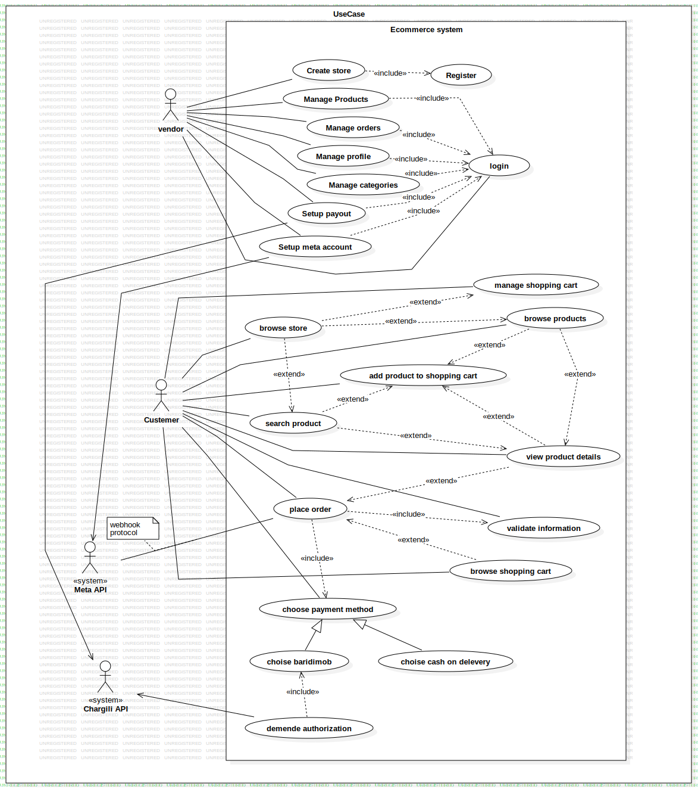
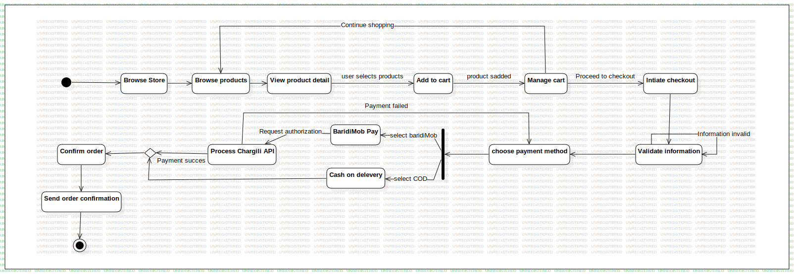
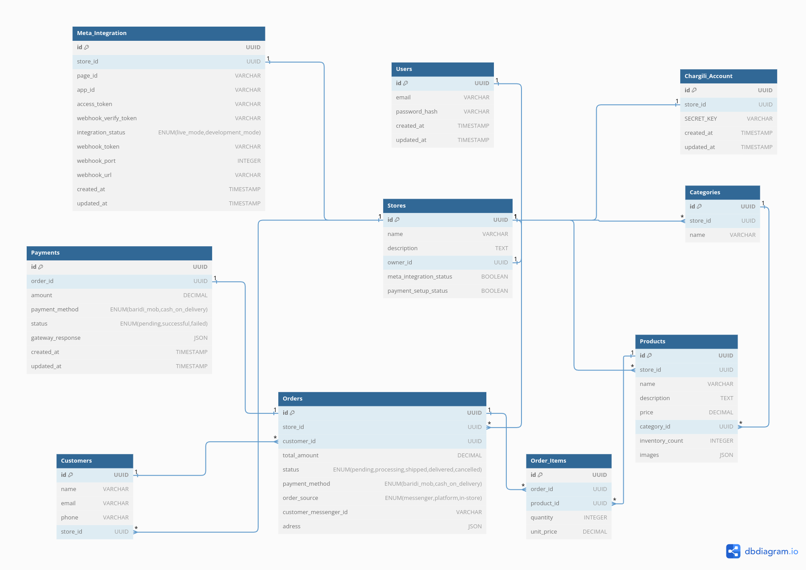

# Complete Ecommerce System Specification 
# Requirement gathering and understanding :

## 1. System Actors

 1.1 Vendor
 1.2 Customer
### 1.3 External Systems
- Chargili API (Payments)
- Meta API (Messenger)

## 2. Functional Requirements

### 2.1 Vendor Functions

#### Store Management
- Create and manage store
- Register and log in
- Setup payouts and Meta integration

#### Product Management
- Add, edit, delete products
- Set prices, manage inventory, upload images

#### Category Management
- Create and organize categories
- Edit category structure

#### Order Management
- View, process, and update orders
- Handle website and Messenger orders
- View history, generate reports

### 2.2 Customer Functions

#### Website Shopping
- Browse, search, and view products
- Manage cart and place orders
- Choose payment:
  - Cash on delivery
  - Baridimob
- Get order confirmations

#### Messenger Shopping
- Browse and order products via Messenger
- Use cash on delivery
- Get confirmations and updates

### 2.3 System Functions

#### Payment Processing
- Integrate Chargili API
- Process payments and refunds
- Manage cash on delivery orders

#### Meta Integration
- Connect Messenger
- Handle messages and orders
- Send responses and updates

#### Order Processing
- Validate info, track status
- Send notifications, update inventory
- Generate invoices


## 2. Non-Functional Requirements

### 2.1 Performance
- System shall load product pages within 3 seconds
- System shall handle at least 10000 concurrent users
- System shall process payment transactions within 3 seconds

### 2.2 Security
- System shall encrypt all sensitive data in transit and at rest
- System shall implement rate limiting for API endpoints

### 2.3 Usability
- System shall be accessible on mobile and desktop devices
- System interface shall be intuitive and user-friendly
- System shall provide clear error messages and feedback


### 2.4 Scalability
- System shall implement caching mechanisms


### 2.6 Maintainability
- System shall follow layred architecture
- System shall maintain comprehensive documentation
- System shall support version control for content

### 3. Use Cases Diagram : 

### 4. Activity Diagram : 


# System Design : 

# System API Design

## 1. API Architecture Overview

### Base URL Structure
```
https://ecommerce.com
```

### Authentication Endpoints

```
POST   /api/v1/auth/register
POST   /api/v1/auth/login
POST   /api/v1/auth/refresh-token
POST   /api/v1/auth/logout
```


### JWT Payload Structure
The payload includes user information and the associated storeId:


{
  "sub": "12345",                            // User ID (subject)
  "email": "user@example.com",               // User's email
  "storeId": "67890",                      // Associated store ID (null if not applicable)
  "iat": 1691376400,                        // Issued at time (Unix timestamp)
  "exp": 1691462800                         // Expiration time (Unix timestamp)
}

### Store Management API


```
GET    /api/v1/stores/{storeId}                 # Get store details and products
POST   /api/v1/stores                              # Create new store
PUT    /api/v1/stores                   # Update store
POST   /api/v1/stores/meta-integration  # Setup Meta integration
POST   /api/v1/stores/payment-setup     # Setup payment methods
```

### Product Management API


```
POST   /api/v1/products                      # Create product
GET    /api/v1/stores/{storeId}/products/{productId}          # Get product details
GET    /api/v1/stores/{storeId}/products          # Get products details
PUT    /api/v1/products/{productId}          # Update product
DELETE /api/v1/products/{productId}          # Delete product
PATCH  /api/v1/products/{productId}/inventory # Update inventory
POST   /api/v1/products/{productId}/images   # Upload images
```

### Category Management API

```
POST   /api/v1/stores/{storeId}/categories                    # Create category
GET    /api/v1/stores/{storeId}/categories                    # List categories
```

### Order Management API

```
POST   /api/v1/orders                                  # Create order
GET    /api/v1/orders/{orderId}                       # Get order details
GET    /api/v1/orders                # List store orders
PATCH  /api/v1/orders/{orderId}/status # Update order status
```


### Meta Integration API

```
POST   /api/v1/messenger/webhook                   # Handle Meta webhook
GET   /api/v1/messenger/webhook                   # verify webhook

```

### Customer Management API

```
POST   /api/v1/customers                                 # Create new customer
PUT   /api/v1/customers/{customerID}                                # update customer details
GET    /api/v1/customers                       # List store customers 
GET    /api/v1/customers/{customerID}                # Get customer details and orders
```


## 2. Query Parameters

Common query parameters for list endpoints:
```
page: number (default: 1)
limit: number (default: 20)
sort: string (e.g., "createdAt:desc")
filter: object (endpoint-specific filters)
```

Example product filtering:
```
GET /api/v1/stores/{storeId}/products?
    category=cat_123&
    minPrice=1000&
    maxPrice=2000&
    search=keyword
```

## 3. Error Responses

```json
{
  "success": false,
  "error": {
    "code": "VALIDATION_ERROR",
    "message": "Invalid input parameters",
    "details": {
      "field": ["error message"]
    }
  }
}
```

## 4. Headers

Required headers for all requests:
```
Authorization: Bearer <token>
Accept: application/json
Content-Type: application/json
```


#  System Components :


### Controllers
- REST API endpoints
- Request validation
- Auth handling
- Route management

### Services
- Business logic
- Transaction handling
- Integration management
- Data orchestration

### Repositories
- Database operations
- CRUD handling
- Query management
- Entity relations

### Order Builder
- Order construction
- Validation logic
- Business rules
- Workflow management

## Data Storage

### MySQL Database
- Data storage


### Redis Cache
```markdown
Store Products:
- Product data caching


Messenger Orders:
- Chat order states
- Conversation context
- Real-time updates
```

### Public Storage
- Image management
- File uploads
- Asset storage
- Media handling

## Frontend

### Single Page Application
- React.js UI
- API integration
- State management
- User interaction

## External Systems

### Meta System
- Facebook integration
- Messenger communication
- Webhook processing
- Order syncing

### Chargili System
- Payment processing
- Authorization
- Transaction management
- Payment API integration
## Full Database Schema
## Entity-Relationship Diagram :





### Users Table
```markdown
- `id`: UUID (Primary Key)
- `email`: VARCHAR
- `password_hash`: VARCHAR
- `created_at`: TIMESTAMP
- `updated_at`: TIMESTAMP
```

### Stores Table
```markdown
- `id`: UUID (Primary Key)
- `name`: VARCHAR
- `description`: TEXT
- `owner_id`: UUID  UNIQUE (Foreign Key to Users)
- `meta_integration_status`: BOOLEAN
- `payment_setup_status`: BOOLEAN
```

### Products Table
```markdown
- `id`: UUID (Primary Key)
- `store_id`: UUID (Foreign Key to Stores)
- `name`: VARCHAR
- `description`: TEXT
- `price`: DECIMAL
- `category_id`: UUID (Foreign Key to Categories)
- `inventory_count`: INTEGER
- `images`: JSON (array of image URLs or paths)
```

### Categories Table
```markdown
- `id`: UUID (Primary Key)
- `store_id`: UUID (Foreign Key to Stores)
- `name`: VARCHAR
```

### Orders Table
```markdown
- `id`: UUID (Primary Key)
- `store_id`: UUID (Foreign Key to Stores)
- `customer_id`: UUID (Foreign Key to Customers)
- `total_amount`: DECIMAL
- `status`: ENUM 
  - 'pending'
  - 'processing'
  - 'shipped'
  - 'delivered'
  - 'cancelled'
- `payment_method`: ENUM
  - 'baridi_mob'
  - 'cash_on_delivery'
- `order_source`: ENUM ('messenger', 'platform', 'in-store') (Default: 'platform')
- `customer_messenger_id`: VARCHAR
- `adress`: JSON
```

### Order_Items Table
```markdown
- `id`: UUID (Primary Key)
- `order_id`: UUID (Foreign Key to Orders)
- `product_id`: UUID (Foreign Key to Products)
- `quantity`: INTEGER
- `unit_price`: DECIMAL
```

### Customers Table
```markdown
- `id`: UUID (Primary Key)
- `name`: VARCHAR
- `email`: VARCHAR
- `phone`: VARCHAR
- `store_id`: UUID (Foreign Key to Stores)
```


### Payments Table
```markdown
- `id`: UUID (Primary Key)
- `order_id`: UUID UNIQUE (Foreign Key to Orders)
- `amount`: DECIMAL
- `payment_method`: ENUM 
  - 'baridi_mob'
  - 'cash_on_delivery'
- `status`: ENUM 
  - 'pending'
  - 'successful' 
  - 'failed'
- `gateway_response`: JSON
- `created_at`: TIMESTAMP
- `updated_at`: TIMESTAMP
```


### Meta_Integration Table
```markdown
- `id`: UUID (Primary Key)
- `store_id`: UUID UNIQUE (Foreign Key to Stores)
- `page_id`: VARCHAR
- `app_id`: VARCHAR
- `access_token`: VARCHAR
- `webhook_verify_token`: VARCHAR
- `integration_status`: ENUM
  - 'live_mode'
  - 'development_mode'
- 'webhook_token': VARCHAR
- 'webhook_port': INTEGER
- 'webhook_url': VARCHAR
- `created_at`: TIMESTAMP
- `updated_at`: TIMESTAMP
```

### Chargili_Account Table
```markdown
- `id`: UUID (Primary Key)
- `store_id`: UUID UNIQUE (Foreign Key to Stores)
- `SECRET_KEY` : VARCHAR
- `created_at`: TIMESTAMP
- `updated_at`: TIMESTAMP
```


## Relationships

### One-to-One Relationships:
1. `Stores.owner_id` → `Users.id`: Each store has a unique owner.
2. `Payments.order_id` → `Orders.id`: Each payment corresponds to a unique order.
3. `Meta_Integration.store_id` → `Stores.id`: Each store has one Meta integration.
4. `Chargili_Account.store_id` → `Stores.id`: Each store has one Chargili account.

### One-to-Many Relationships:
1. `Stores.id` → `Products.store_id`: A store can have multiple products.
2. `Stores.id` → `Categories.store_id`: A store can have multiple categories.
3. `Stores.id` → `Orders.store_id`: A store can have multiple orders.
4. `Stores.id` → `Customers.store_id`: A store can have multiple customers.

5. `Categories.id` → `Products.category_id`: A category can include multiple products.

### Many-to-Many Relationships:
1. **Products and Orders**: 
   - **Through Order_Items**: Products can appear in multiple orders, and orders can contain multiple products. This relationship is managed via the `Order_Items` table, which connects the **Products** and **Orders** tables.
   

   

### Relationship Constraints Explanation


#### 1. Cascade 
   - Automatically deletes related records when the parent record is deleted
   - Used when child records cannot exist without the parent
   - Example: Deleting a Store deletes all its Products, Categories, Orders

####  2. Restrict 
   - Prevents deletion of a record if related records exist
   - Protects against unintended data loss
   - Example: Cannot delete a Customer with existing Orders

#### 3. SetNull 
   - Sets foreign key to NULL when parent record is deleted
   - Allows child records to exist independently
   - Example: Deleting a Category sets `category_id` to NULL in Products


### Recommended Relationship Constraint Patterns

1. **Strong Relationships (Cascade)**
   - Store → Products
   - Store → Categories
   - Store → Orders
   - Store → Customers

2. **Protected Relationships (Restrict)**
   - Order → Payment
   - Customer → Orders

3. **Flexible Relationships (SetNull)**
   - Product → Category

