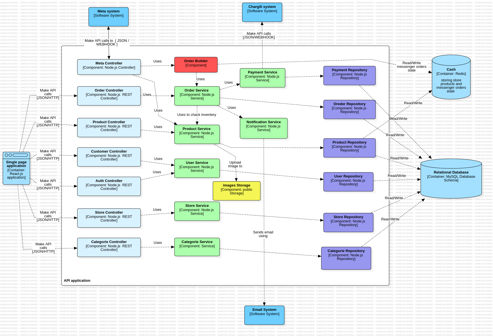

# E-commerce System Components



## Backend Components

### Controllers
- REST API endpoints
- Request validation
- Auth handling
- Route management

### Services
- Business logic
- Transaction handling
- Integration management
- Data orchestration

### Repositories
- Database operations
- CRUD handling
- Query management
- Entity relations

### Order Builder
- Order construction
- Validation logic
- Business rules
- Workflow management

## Data Storage

### MySQL Database
- Data storage


### Redis Cache
```markdown
Store Products:
- Product data caching


Messenger Orders:
- Chat order states
- Conversation context
- Real-time updates
```

### Public Storage
- Image management
- File uploads
- Asset storage
- Media handling

## Frontend

### Single Page Application
- React.js UI
- API integration
- State management
- User interaction

## External Systems

### Meta System
- Facebook integration
- Messenger communication
- Webhook processing
- Order syncing

### Chargili System
- Payment processing
- Authorization
- Transaction management
- Payment API integration